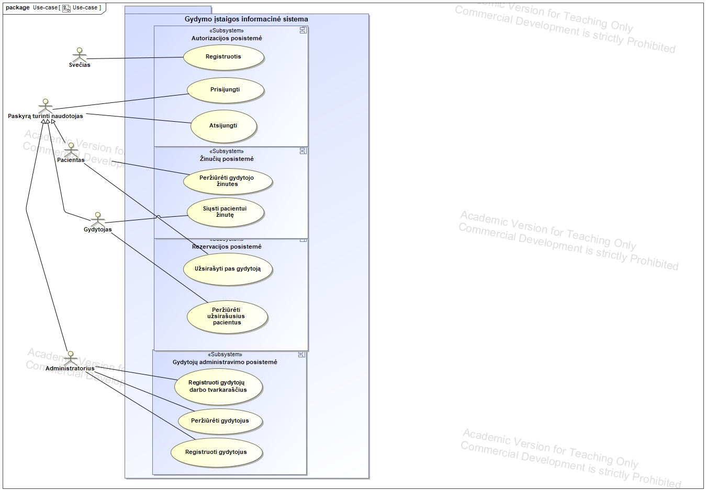
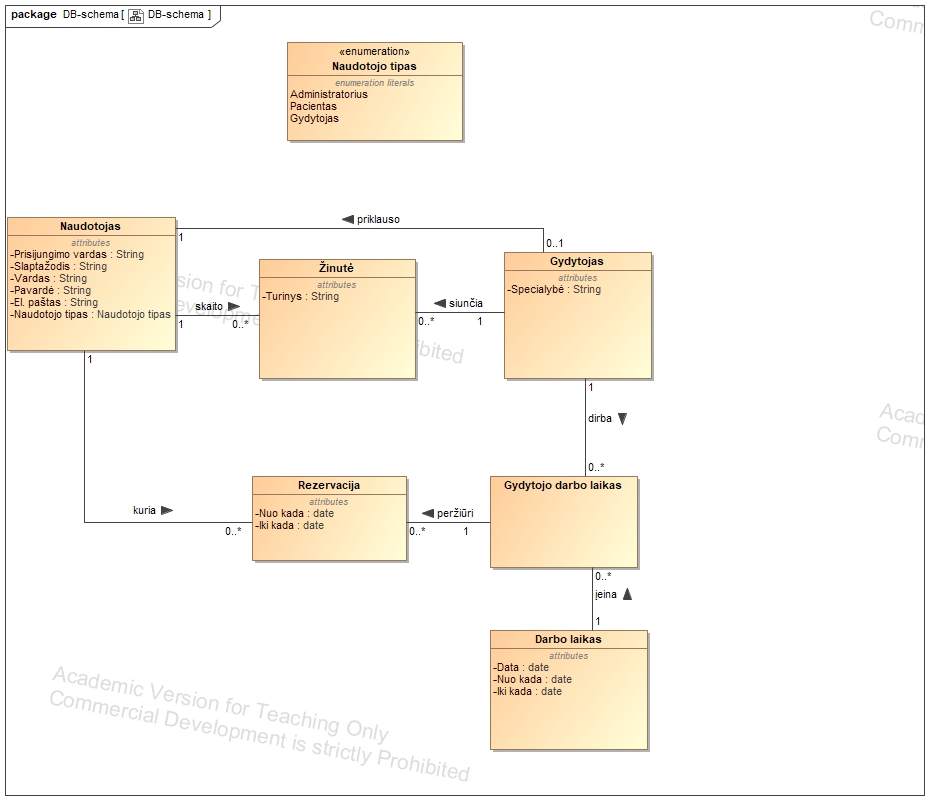

# Healthcare Institution's Information system

## A simple web app for university (KTU)

This project is built with React and Express using JavaScript.

# Main goal

Familiarise with Docker and its functionality to build a simple web app.

# Key points

- Learnt to write Dockerfiles and docker-compose.yml
- Gained experience in streamlining dockerization development
- Successfully ran containers on a Linux (Lubuntu) VM
- Used a MySQL database image

### Use-case diagram

### Database schema

### Additional Information
